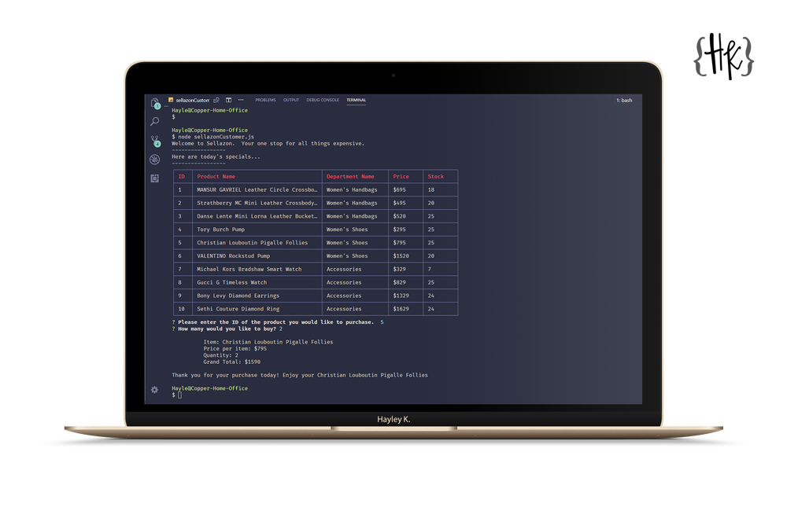

# Sell-azon

This is a functioning CLI store based off of the concept of Amazon. It uses Node.js and mySQL.



## How to use

```
git clone git@github.com:CopperCo/Sell-azon.git
cd sellazon
npm install
node sellazonCustomer.js
```

Then follow the prompts on the screen.

## Tools Used

- mySQL Server
- mySQL Workbench
- NodeJS
- Node Packages
  - mySQL
  - Inquirer
  - cli-table

## Support

If you find an error or bug please [let me know.](https://github.com/CopperCo/Sell-azon/issues)
